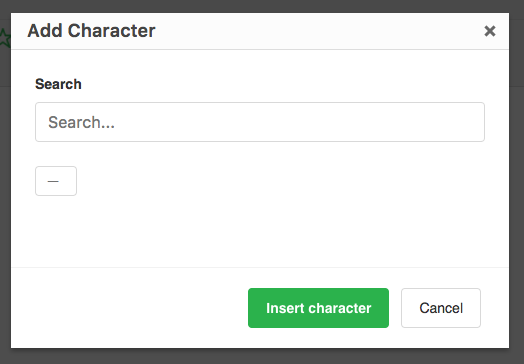

# Feedly Add Special Characters Plugin
**FAS** is a Wordpress plugin to add a special character into our Wordpress post.

## Installation
Download the zip of this repository or clone it into your ```your-wordpress-site/wp-content/plugins``` folder.

In your admin panel, go to **Plugins** and activate the plugin.

## How to use it
Now, when you go to a post, you can see a new  button in your editor bar.




Now, just click on "Insert icon" button.

*Don't forget to add some style in your ```editor-style.css```*
